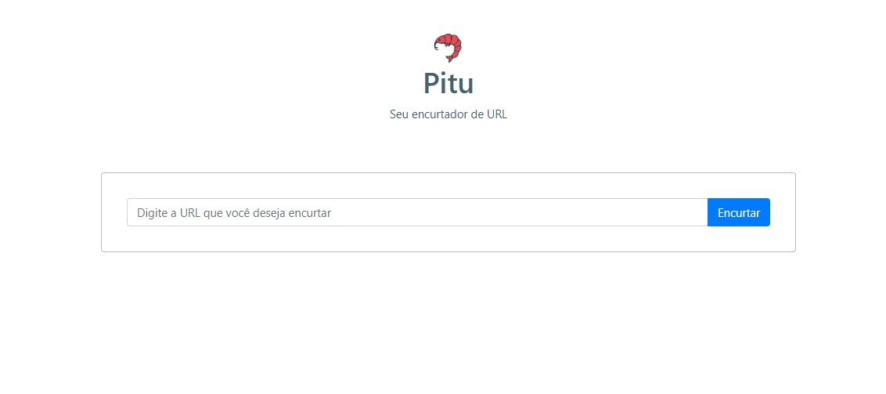

# Pitu

## Sobre o Projeto

O **Pitu** é uma aplicação web de microsserviço que transforma uma URL longa em uma URL curta e mais fácil de memorizar, e também tem a função de estatíticas da URL permitindo a vizualização da quantidade de acesso que recebeu o link encurtado.


O projeto tem o nome inspirado no camarão **pitu**, que nasce bem pequeno mas se torna gigante quando adulto. 


 


## Tecnologias Utilizadas

-  [Axios](https://github.com/axios/axios)
-  [Date-fns](https://date-fns.org/)
-  [Express](https://expressjs.com/)
-  [MySQL](https://www.mysql.com/)
-  [Node.js](https://nodejs.org/en/)
-  [NPM](https://www.npmjs.com/)
-  [React Bootstrap](https://react-bootstrap.github.io/)
-  [ReactJS](https://reactjs.org/)
-  [SCSS](https://sass-lang.com/)
- [Sequelize](https://sequelize.org/)
-  [Styled Components](https://styled-components.com/)
-  [Typescript](https://www.typescriptlang.org/)
- [Yarn](https://yarnpkg.com/)


## Como Executar

- ### **Pré-requisitos**

  - É **necessário** possuir o **[Node.js](https://nodejs.org/en/)** instalado no computador.
  - É **necessário** possuir o **[Git](https://git-scm.com/)** instalado e configurado no computador.
  - Também, é **preciso** ter um gerenciador de pacotes seja o **[Yarn](https://yarnpkg.com/)** ou **[NPM](https://www.npmjs.com/)**.
  - Por fim, é **essencial** ter o **[MySQL](https://www.mysql.com/)** instalado na máquina.

1. Clone o repositório na sua máquina:

`git clone https://github.com/monalizavitor/pitu.git`

2. Para rodar o projeto:

```
  # API
  $ cd backend
  $ npm install || yarn install
  $ npm start || yarn start

  # CONEXÃO COM BANCO DE DADOS MYSQL
  > pasta backend > database.ts
  # MYSQL://<usuario>:<senha_my_sql>@<sua_url>:3306/<nome_do_banco_de_dados>
  # APLICAÇÃO WEB
  $ cd frontend
  $ yarn install || npm install
  $ yarn start || npm start
```

Projeto realizado durante a **Semana Full Stack JS**, projeto do professor [Luiz Duarte](https://www.luiztools.com.br).
